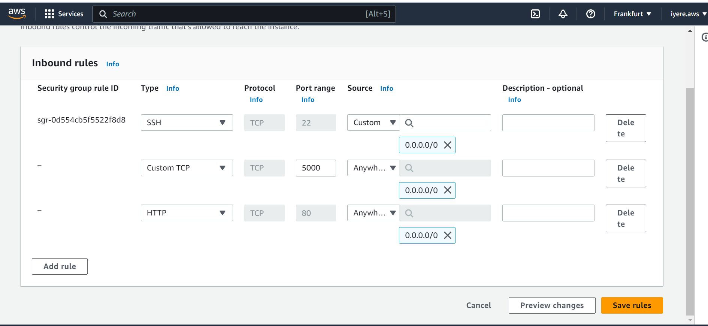

#project 3. MERN stack implementation.

##To deploy a simple To-Do application that creates To-Do lists

###Step 1 - Backend configuration and installing node.js

`sudo apt update`

`sudo apt upgrade`

Get location of Node.js software from Ubuntu repositories

`curl -fsSL https://deb.nodesource.com/setup_18.x | sudo -E bash -`

Install Node.js

`sudo apt-get install -y nodejs`

The command above installs both nodejs and npm. NPM is a package manager for Node like apt for Ubuntu, it is used to install Node modules & packages and to manage dependency conflicts.

verify node installation

`node -v`

verify node installation

`npm -v`

create a new directory for Todo project

`mkdir Todo`

`ls`

[verifying Todo directory was created](./images/backend-configuration/verifying-Todo-directory-created.png)

`ls -lih`

[showing information about files and directory](./images/backend-configuration/showing-info-about-files-and-directories.png)

change directory to newly craeted one

`cd Todo`

initialize project

`npm init`

confirm package.json file was created

`ls`

update npm

`sudo npm install -g npm@9.6.1`

###INSTALL EXPRESSJS

`npm install express`

create file index.js

`touch index.js`

`ls`

install the dotenv module

`npm install dotenv`

open index.js file

`vim index.js`

 start our server to see if it works. Open your terminal in the same directory as your index.js file and type: node index.js

 `node index.js`

edit inbound rules in AWS console

[opening url with public IP in browser](http://3.70.240.168:5000/)

create routes that will define various endpoints that the To-do app will depend on

`mkdir routes`

change dirctory to routes directory

`cd routes`

create a file api.js

`touch api.js`

open the file api.js with vim

`vim api.js`

paste code with vim

